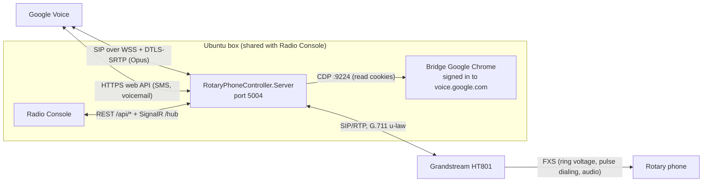

# Architecture

This document describes RotaryPhone as it is deployed: one ASP.NET Core server on an Ubuntu 24.04 box,
taking Google Voice calls and ringing a rotary phone through a Grandstream HT801. Earlier designs
(Raspberry Pi, Windows NUC, a Chrome-extension bridge, Bluetooth HFP as the main path) are in
[docs/archive/](docs/archive/README.md). Specific decisions are recorded as ADRs in
[docs/architecture/decisions/](docs/architecture/README.md).

## Deployment view

- The server runs as the `rotary-phone` systemd service from `/opt/rotary-phone`, listening on port 5004
  (`deploy/rotary-phone.service`).
- The HT801 is on a dedicated point-to-point Ethernet link to the box, so it is reachable only from the
  box. The server learns its address from the HT801's SIP REGISTER, with the configured address as a
  fallback ([docs/HT801-ADDRESS.md](docs/HT801-ADDRESS.md),
  [ADR 2026-07-29](docs/architecture/decisions/2026-07-29-ht801-learned-registrar-binding.md)).
- The bridge Chrome is a dedicated profile kept alive by user-level systemd timers. It holds the Google
  session; it carries no call audio.

## Projects

| Project | Target | Role |
|---|---|---|
| `RotaryPhoneController.Server` | `net10.0` (+ Windows target) | ASP.NET Core host: DI wiring (`Program.cs`), REST controllers, SignalR hub `RotaryHub` at `/hub`, inter-service auth, serves the built React UI from `wwwroot`. Also has a `gv-login` command-line mode that extracts cookies over CDP and exits. |
| `RotaryPhoneController.Core` | `net10.0` (+ Windows target) | `CallManager` state machine, `PhoneManagerService` (one `CallManager` per configured phone), `SIPSorceryAdapter` (SIP to the HT801), `CallAdapterRegistry`, registrar bindings, bell-failure tracking, call history (SQLite), contacts, HT801 config/reachability, and the Bluetooth adapters (real and mock). |
| `RotaryPhoneController.GVBridge` | `net10.0` (+ Windows target) | Google Voice: `GVApiAdapter` (the `GVApi` call adapter), `GvSipTransport` (SIP over WebSocket), `GVAudioBridgeService` (GV audio to HT801 RTP), cookie storage and refresh, CDP cookie extraction, SMS/voicemail/thread clients, the thread poller, and the `/api/gvbridge/*` controllers. |
| `RotaryPhoneController.GVTrunk` | `net10.0` | An alternative SIP-trunk path (`SipTrunk` mode) through a third-party SIP provider, with `/api/gvtrunk/*` endpoints. Registered but not the default mode. |
| `RotaryPhoneController.Client` | React + TypeScript (Vite) | Diagnostics and management UI: dashboard, call history, contacts, Google Voice and SIP diagnostics, Bluetooth pairing. `npm run build` writes into the server's `wwwroot`. |
| `*.Tests` (four projects) | `net10.0` | xUnit tests for Core, Server, GVBridge and GVTrunk. |
| `src/BluetoothPoC` | `net9.0-windows` | Bluetooth proof of concept. Not in the solution. |

Shell and Python tooling for the box lives in `deploy/` (deploy script, bridge scripts, session alarm,
auto-relogin, drift check, systemd units, GNOME Shell extension) and `scripts/` (including
`bt_manager.py`, used by the Bluetooth path).

## Call adapters

`CallManager` talks to a mobile-side "call adapter" through `ICallAdapterRegistry`. Three are registered:

| Mode | Adapter | Status |
|---|---|---|
| `GVApi` | `GVApiAdapter` (GVBridge) | **Default** (`GVBridge:DefaultMode` in `appsettings.json`). The live path. |
| `BluetoothHfp` | `BluetoothCallAdapter` (Core) | A mobile phone over Bluetooth HFP. See [Bluetooth](#bluetooth). |
| `SipTrunk` | `SipTrunkCallAdapter` (Server, wraps GVTrunk) | Alternative trunk path. Not used on the box. |

The mode can be read and switched at `GET`/`PUT /api/gvbridge/adapter/mode`. The enum also has a
`GVBrowser` value left over from the retired Chrome-extension design; no adapter is registered for it.

## Call flows (GVApi mode)

### Incoming call

1. Google Voice sends an INVITE over the SIP WebSocket. `GvSipTransport` does **not** answer it yet
   (deferred answer).
2. `GVApiAdapter` raises the incoming call; `CallManager` moves `Idle` to `Ringing` and broadcasts
   `IncomingCall` and `CallStateChanged` over SignalR.
3. `SIPSorceryAdapter` sends a SIP INVITE to the HT801's learned address, and the HT801 rings the bell.
   If the INVITE gets no answer, a socket error or an error response, `BellFailureTracker` records it
   and the hub sends `BellInviteFailed` (later `BellRecovered`); Radio Console acknowledges with
   `POST /api/phone/bell-failure/ack`.
4. When the handset is lifted, the HT801 answers the INVITE. Only then does the server send the 200 OK to
   Google Voice, and the call becomes `InCall`.
5. `GVAudioBridgeService` relays audio: Opus over DTLS-SRTP (48 kHz) on the Google side, G.711 u-law RTP
   (8 kHz) on the HT801 side.

Because the server has not answered, a caller who hangs up during the ring makes Google Voice send a SIP
CANCEL, and the server stops the bell promptly.

**Declining.** Radio Console's Ignore button calls `POST /api/phone/decline`. From `Ringing` it stops the
bell (CANCEL to the HT801), sends `603 Decline` on RotaryPhone's Google Voice leg, returns to `Idle` and
replies `200 {"declined": true}`; from any other state it replies `409` and does nothing. Google Voice
rings the owner's linked cell phone as a separate leg, and the 603 does not stop that leg. This is a known
limitation.

### Outgoing call

1. The user lifts the handset and dials. The HT801 decodes the pulses and, after its dial timeout, sends
   an INVITE carrying the dialed number.
2. `SIPSorceryAdapter` reports the digits; `CallManager` moves to `Dialing`, records a call-history
   entry and calls `GVApiAdapter.PlaceCallAsync`.
3. The call becomes `InCall` when Google Voice reports the far end answered, and the audio bridge starts.

### Hang-up

Either side ends the call (handset on-hook produces a BYE from the HT801; a remote hang-up arrives as a
BYE from Google Voice). `CallManager` ends the other leg, stops the audio bridge, writes the end time to
call history and returns to `Idle`.

## Google Voice authentication

- Google Voice requests are authenticated with the browser session's cookies (SAPISIDHASH). The server
  stores them encrypted under `data/`.
- **Cookie source.** The bridge Chrome (`~/bin/gv-bridge-ensure.sh`, kept alive by a 2-minute watchdog
  timer) holds the signed-in session with CDP on port 9224. A cron job on the box calls
  `POST /api/gvbridge/cookies/refresh-from-browser` every 20 minutes, and the server also refreshes and
  re-reads cookies itself when Google returns 401.
- **Keeping the browser usable on a kiosk box.** When the bridge launches, `gv-keyring-unlock.py` unlocks the
  GNOME login keyring from a TPM-bound systemd credential (so Chrome does not stop on an unlock prompt
  on an auto-login box), and the `gv-bridge-behind@rotaryphone` GNOME
  Shell extension keeps the bridge window below Radio Console's kiosk window. Both are installed by
  `deploy/install-gv-bridge.sh`.
- **When the session is lost.** SIP registration depends on the same session, so a signed-out browser
  takes the phone down. `GET /api/gvbridge/status` reports it (`available`, `sipRegistered`,
  `cookiesValid`, `browserRefreshOutcome`), and the session alarm (`deploy/gv-session-alarm.sh`, a
  5-minute user timer) sends that status to a notification gateway. Recovery today is a person signing in
  again in the bridge Chrome. An automatic re-login (`deploy/gv-auto-relogin.sh`, which drives the
  bridge Chrome through `deploy/gv-relogin-signin.py`) is installed by every deploy with its timer
  disabled. Turning it on is a deliberate step (`install-gv-auto-relogin.sh --enable`) that refuses
  without the on-box credential file, the session alarm and the sign-in driver
  ([docs/gv-relogin-driver-contract.md](docs/gv-relogin-driver-contract.md)).

Protocol details are in [docs/research/gv-protocol-notes.md](docs/research/gv-protocol-notes.md); setup
and operations are in [docs/SETUP-GVBridge.md](docs/SETUP-GVBridge.md).

## Messaging (voicemail and SMS)

GVBridge reads voicemail and SMS threads through Google Voice's web API, caches voicemail audio under
`data/`, and polls threads (`GvThreadPoller`). New items are pushed to Radio Console over SignalR
(`VoicemailReceived`, `SmsReceived`, `SmsSent`, `ReadStateChanged`). Sending SMS and marking items read
are implemented but disabled by default (`EnableSmsSend`, `EnableMarkRead`). See
[ADR 2026-06-20 (voicemail and SMS)](docs/architecture/decisions/2026-06-20-gv-voicemail-sms-radioconsole.md)
and [ADR 2026-06-20 (mark-read)](docs/architecture/decisions/2026-06-20-gv-markread-readstate-contract.md).

## Radio Console interface

Radio Console is a separate service on the same box. It uses:

- **REST**, for example `GET /api/phone/status`, `GET /api/phone/system-status`,
  `POST /api/phone/decline`, `POST /api/phone/bell-failure/ack`, `GET /api/gvbridge/status`, and the
  `/api/gvbridge/sms/*` and `/api/gvbridge/voicemail/*` endpoints.
- **SignalR** at `/hub`: `IncomingCall`, `CallStateChanged`, `SystemStatusChanged`, `BellInviteFailed`,
  `BellRecovered`, `SmsReceived`, `SmsSent`, `VoicemailReceived`, `ReadStateChanged`, plus diagnostics
  and Bluetooth device events.
- **Optional shared-key auth.** When `GVBridge:InterServiceAuthKey` is set, the `/api/gvbridge/*`
  endpoints and the hub accept an `X-RotaryPhone-Auth` header. It is off by default.

Unknown `/api/*` routes return a JSON 404 rather than the UI's `index.html`. The authoritative contract,
including field-level semantics, is in
[docs/prompts/RADIO-CONSOLE-BT-AUDIO-BOUNDARY.md](docs/prompts/RADIO-CONSOLE-BT-AUDIO-BOUNDARY.md).

## Bluetooth

The original design bridged the rotary phone to a mobile phone over Bluetooth HFP, and that code is still
in Core: `BlueZBtManager` with `scripts/bt_manager.py` on Linux, `WindowsBluetoothHfpAdapter` on Windows,
`ScoRtpBridge` for SCO audio, and mock implementations of each. Whether real Bluetooth is used is
controlled by `RotaryPhone:UseActualBluetoothHfp` and `RotaryPhone:BluetoothAdapter`.

On the deployed box the call path is Google Voice, no mobile phone is connected over HFP, and the HFP
hang-up path logs through the mock adapter. If HFP is ever used again, RotaryPhone owns the Intel AX201
adapter (`hci1`) and Radio Console owns the other adapter; read the boundary document before changing
anything Bluetooth- or audio-related.

## Diagnostics

The React UI at `http://<box>:5004/` includes a diagnostics page. The matching endpoints are under
`/api/diagnostics` (status, SIP message log, call timeline, audio-bridge counters, HT801 config check,
test ring). See [docs/SETUP-GVBridge.md](docs/SETUP-GVBridge.md#diagnostics).
